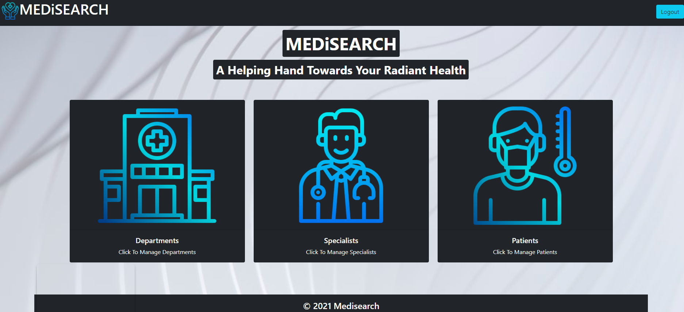

# MEDiSEARCH 

[](http://unlicense.org/)

## Description
MEDiSEARCH is a dynamic hospital management tool that provides an efficient way to manage organization-related and medical-related information within ONE app. This application is for internal use only.

Please use the following credentials to test the application:
username = testuser
password = test1234

### URL

Deployed Application on Heroku: [https://med-i-search.herokuapp.com/](https://med-i-search.herokuapp.com/)

### Technologies used
* New library used: Argon2
* VSCode
* GitHub
* Heroku
* Javascript
* Node.js
* Express.js
* Sequelize
* mySql
* Bootstrap
* Animate.CSS

### Future Development
* Validation for all the front-end form fields.
* Add more form fields to all the individual classes.
* Add manytomany relationships to generate medical reports.
* Add another full stack development for Surgery.

## Table of Contents
* [Installation](#installation)
* [Usage](#usage)
* [Tests](#tests)
* [Contributors](#contributors)
* [Screenshots](#screenshots)
* [License](#license)

## Installation
### If you want to run locally
1. Clone repository to your local machine.
2. Run 'npm install' in your command line.
3. Run 'npm start'.

## Usage

* Go to the deployed link in description
* Sign up using your credentials.
* Login using your credentials. 
* From the homepage, choose from one of the 3 options: Departments, Specialists and Patients. 
* When you click on Departments, you can view a list of existing departments and have the option to add new departments. 
* Within the Specialists, users can view a list of specialists, add new specialists and edit existing ones. 
* Within Patients, users can view a list of patients, add new patients and edit existing ones.

## Tests
api testing: 

1. Install Insomnia Core or Postman (testing software)
2. Using the above installed software test the following URLs to test the APIs

### APIs URL

#### Users Model

1. GET Request for all users

[https://med-i-search.herokuapp.com/api/users](https://med-i-search.herokuapp.com/api/users)

2. POST Request to add one user

[https://med-i-search.herokuapp.com/api/users](https://med-i-search.herokuapp.com/api/users)

```
Use the api with following json body as example:

{
  "username": "admin2",
  "email": "Admin2@admin.com",
  "password": "12345678"
}
```

3. GET Request for one User

https://med-i-search.herokuapp.com/api/users/{id of existing user}

4. DELETE Request for one User

https://med-i-search.herokuapp.com/api/users/{id of existing user}


```
Use the following as example DELETE AND GET FOR ONE USER:

https://med-i-search.herokuapp.com/api/users/1
```


#### Departments Model


1. GET Request for all Departments

[https://med-i-search.herokuapp.com/api/departments](https://med-i-search.herokuapp.com/api/departments)


2. GET Request for one Departments

https://med-i-search.herokuapp.com/api/departments/{id of existing department}


```
Use the following as example :

https://med-i-search.herokuapp.com/api/departments/1
```

3. POST Request for one Department

[https://med-i-search.herokuapp.com/api/departments](https://med-i-search.herokuapp.com/api/departments)

```
Add the follwing json body to test post request

{
  "DepartmentName" : "Oncology"
}
```


#### Specialists Model

1. GET Request for all Specialist

[https://med-i-search.herokuapp.com/api/specialists](https://med-i-search.herokuapp.com/api/specialists)

2. GET Request for one Specialist

https://med-i-search.herokuapp.com/api/specialists/{id of existing specialist}

3. DELETE Request for one Specialist

https://med-i-search.herokuapp.com/api/specialists/{id of existing specialist}

4. PUT Request for one Specialist

https://med-i-search.herokuapp.com/api/specialists/{id of existing specialist}


```
Use the following as example for GET, PUT & DELETE :

https://med-i-search.herokuapp.com/api/specialists/1

Add the following json body as example for only PUT request:

{
  “SpecialistName”: “Carla G”,
  “Speciality”: “Oncologist”
}
```


5. POST Request for one Specialist

[https://med-i-search.herokuapp.com/api/specialists](https://med-i-search.herokuapp.com/api/specialists)

```
Add the following json body as example for post request:

{
  “SpecialistName”: “Carla G”,
  “Speciality”: “Oncologist”
}

```

#### Patients Model

1. GET Request for all patients

[https://med-i-search.herokuapp.com/api/patients](https://med-i-search.herokuapp.com/api/patients)


2. GET Request for one Patient

https://med-i-search.herokuapp.com/api/patients/{id of existing patient}

3. PUT Request for one Patient

https://med-i-search.herokuapp.com/api/patients/{id of existing patient}


```
Use the following as example for GET & PUT :

https://med-i-search.herokuapp.com/api/patients/1

Add the following json body as example for only PUT request:

{
	"PatientName": "barbara",
	"PatientStatus": "Active",
	"PatientType": "Inpatient",
	"prescription": "T2",
	"diagnosis": "OA, asthama",
	"reports": "in progress",
	"isVaccinated": "true"
}
```


4. POST Request for one Patient

[https://med-i-search.herokuapp.com/api/patients](https://med-i-search.herokuapp.com/api/patients)

```
Add the following json body as example for post request

{
	"PatientName": "barbara",
	"PatientStatus": "Active",
	"PatientType": "Inpatient",
	"prescription": "T2",
	"diagnosis": "OA, asthama",
	"reports": "in progress",
	"isVaccinated": "true"
}

```


### Local testing
1. Install Insomnia Core or Postman (testing software)
2. Using the above installed software test, replace the above mentioned URLs heroku address before '/' with localhost:3001.

## Screenshots


## Contributors
### Please feel free to contact us with any questions
* Ravneet Panglia |
  Contact email: ravneetpanglia@gmail.com |
  GitHub: [rpanglia](https://github.com/rpanglia)
* Purvi Mecwan | 
  Contact email: princy.mecwan94@gmail.com |
  GitHub: [PurviMec](https://github.com/PurviMec)
* Scott Bradley |
  Contact email: scottabradley91@gmail.com |
  GitHub: [ScalexanderB](https://github.com/ScalexanderB)
* Sehajpreet Singh |
  Contact email: sehajmagan@gmail.com |
  GitHub: [Sehaj97](https://github.com/sehaj97)

## License
This project is unlicensed.